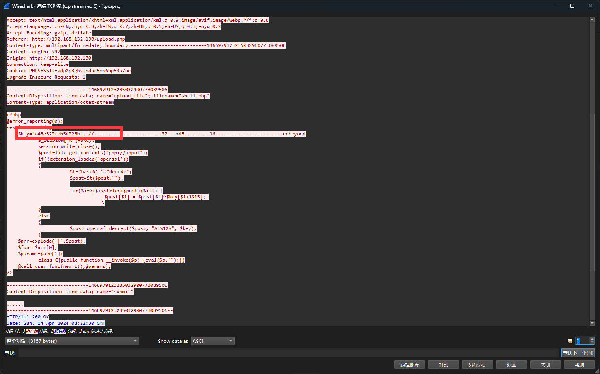
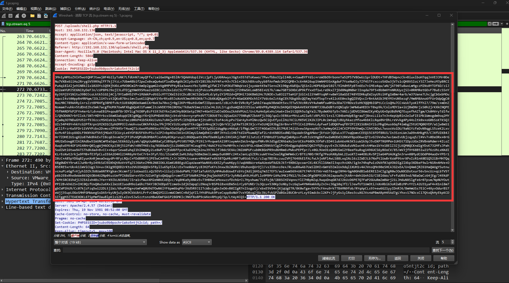
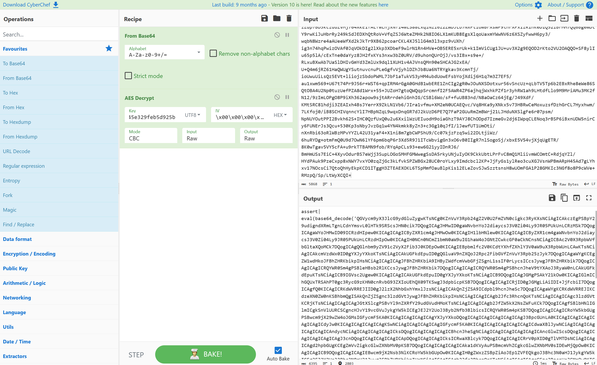
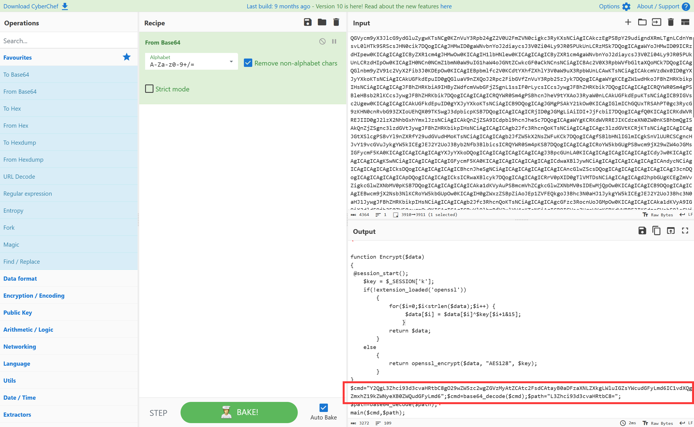
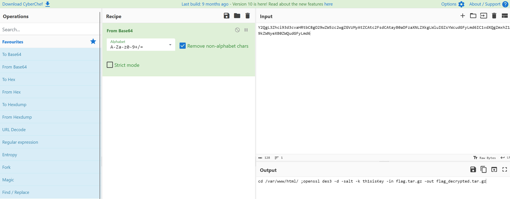
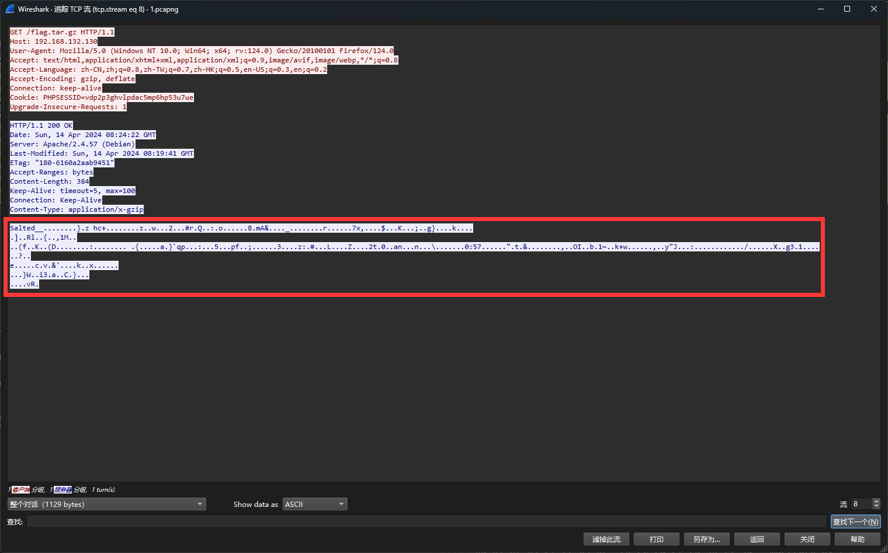
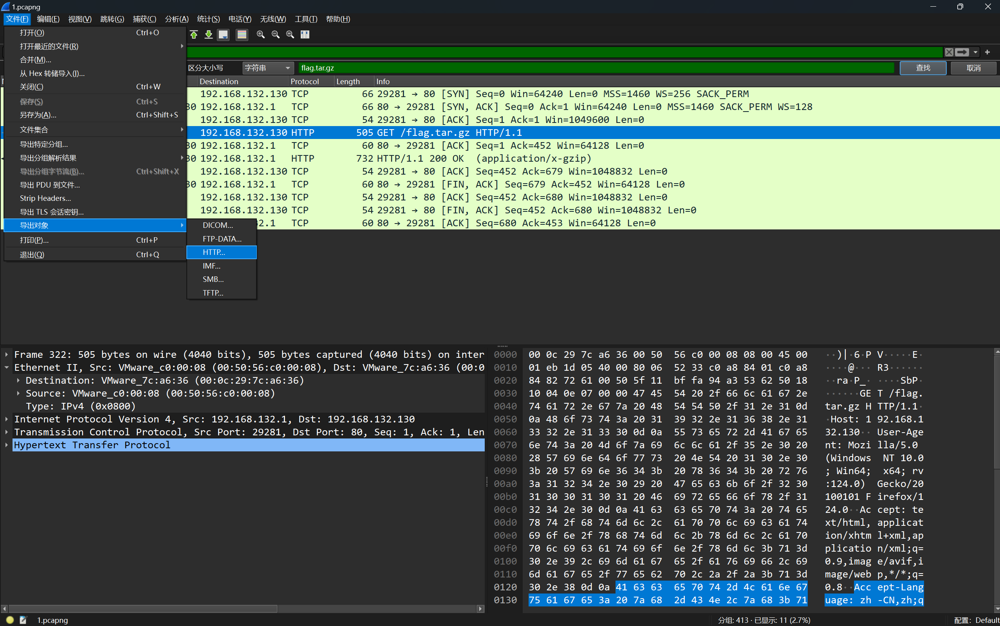
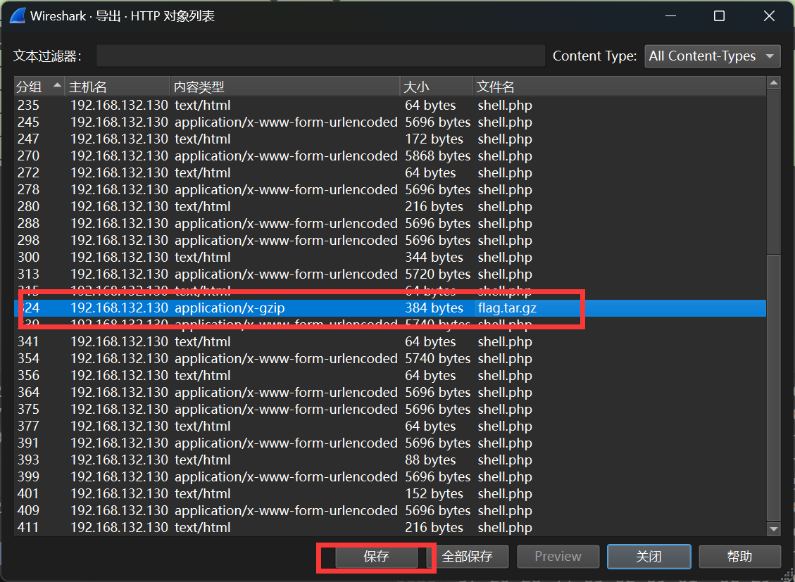
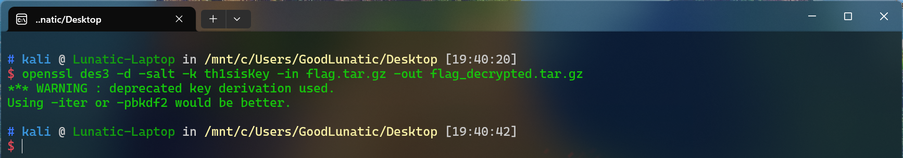
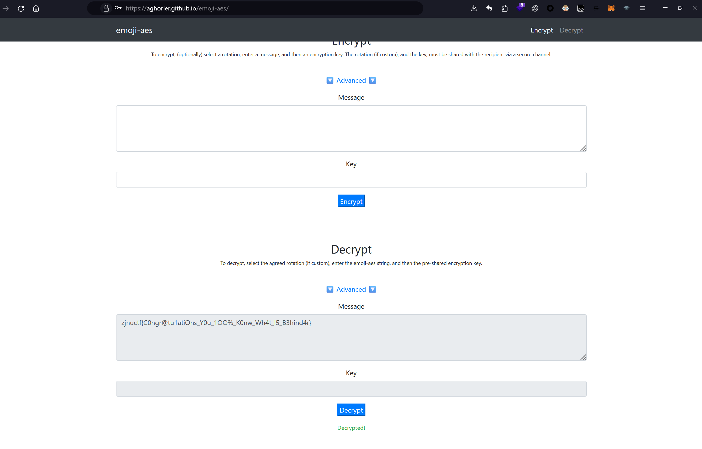

# ez_Behinder wp

题目附件给了一个 pcapng 流量包，根据题目提示或者稍微翻一下就可以发现明显是冰蝎流量

追踪 TCP 流，在流0中发现了冰蝎webshell的源码，从中可以得到加密的 key=e45e329feb5d925b



然后就是逐一对流量包中请求和响应的加密数据进行解密，这里就简单的以流5中的数据为例

详细的解密过程也可以参考 [Lunatic的博客](https://goodlunatic.github.io/2024/04/02/Network%20Traffic%20Analysis/)

首先将请求中的数据复制出来，然后使用 CyberChef 进行解密









解密完后可以得到如下的命令，可以看出出题人把 th1sisKey 作为 key 解密了 flag.tar.gz 文件

```bash
cd /var/www/html/ ;openssl des3 -d -salt -k th1sisKey -in flag.tar.gz -out flag_decrypted.tar.gz
```

在流8中可以看到请求了 flag.tar,gz 一次，因此响应的数据就是 flag.tar.gz 的具体内容

我们先将其显示为十六进制的原始数据，然后使用010导入十六进制数据，保存为 flag.tar.gz 即可



如果大家嫌这里手动提取比较麻烦，也可以直接点击 文件 -> 导出对象 -> HTTP，然后选中 flag,tar,gz 保存即可





然后我们在 Linux系统 下也用下面这个命令进行解密即可

```bash
openssl des3 -d -salt -k th1sisKey -in flag.tar.gz -out flag_decrypted.tar.gz
```



解压 flag_decrypted.tar.gz 后可以得到一个 flag 文件，里面的内容如下，是一堆 emoji 表情

```
🙃💵🌿🎤🚪🌏🐎🥋🚫😆😍🔬👣🖐🌏😇🥋😇😊🍎🏹👌🌊☃🦓🌏🐅🥋🚨📮🐍🎈📮📂✅🐍⏩⌨🎈😍🌊😇🐍☺💧🥋🍌🎤🍍😇👁🦓😇🍍📮📂🎅😡🍵✖✉🏹⌨🍵🎤😆🍵🚹🏹🍎🚨ℹ☃👑🎤🚪💵😎😀😎🔬💵🦓🏹👉🦓✖😀🐘🔪⌨🎈🥋👌🍌🚹😂✉🍎🍌🏎👌🏹💵👌👁🎃🗒
```

因此我们猜测是 emoji-aes 加密，根据题面提示，很容易就可以想到解密的密钥就是上面用过的 th1sisKey

直接使用 [在线网站](https://aghorler.github.io/emoji-aes/) 解密即可得到flag：zjnuctf{C0ngr@tu1atiOns_Y0u_1OO%_K0nw_Wh4t_l5_B3hind4r}




