# LaLaLand Writeup

题目附件给了一个压缩包，解压后可以得到一张 LaLaLand.jpg 和一个 flag.zip

发现 flag.zip 加密了，猜测密钥需要从 jpg 中获得

010 打开 jpg 图片，发现末尾有多余数据，看 50 4B 03 04 的文件头，是一个压缩包

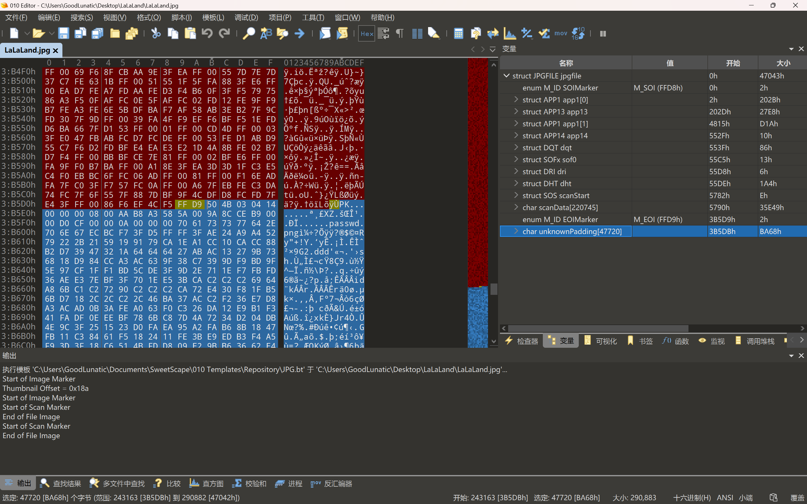

手动提取或者直接 foremost 提取出压缩包并解压，可以得到一个 passwd.png

但是没有办法直接打开查看图片，我们使用010打开，发现缺少了图片的文件头

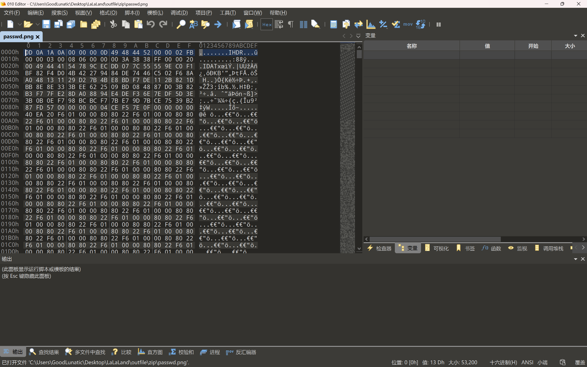

因此我们补上 89 50 4E 47 后就可以正常查看了

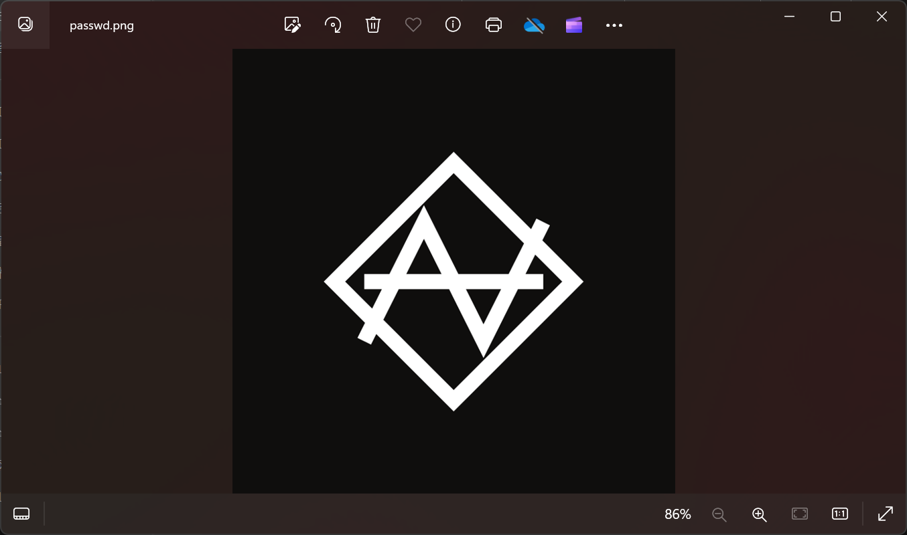

直接查看发现没有什么信息，我再用010打开这张图片，发现CRC报错

因此猜测是文件的宽高被调整过了

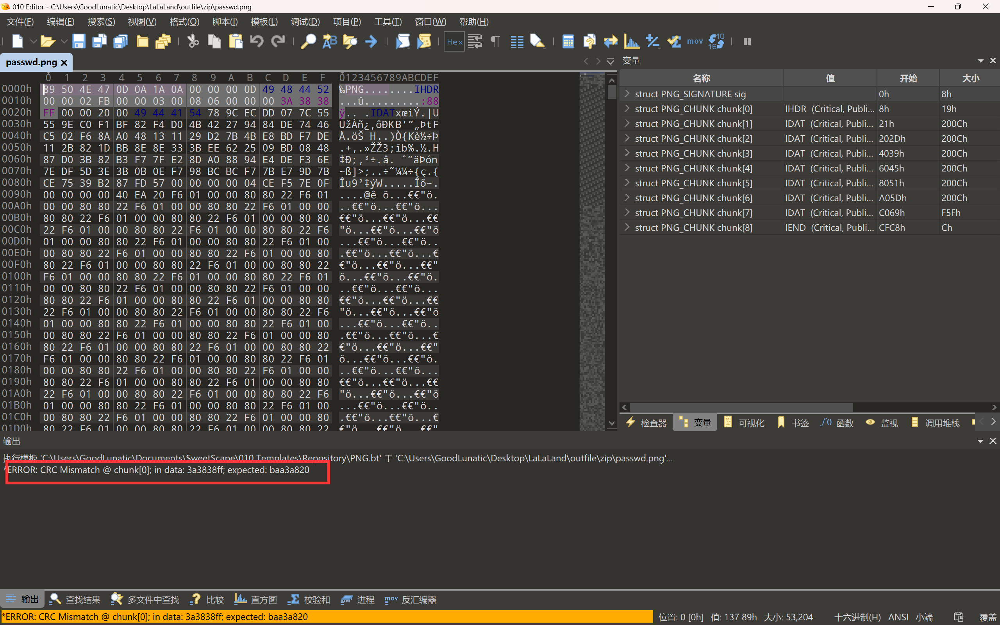

我们手动调整宽高，或者直接用脚本爆破正确的宽高

调整完后，发现图片下面藏了一个二维码，但是定位块被去掉了

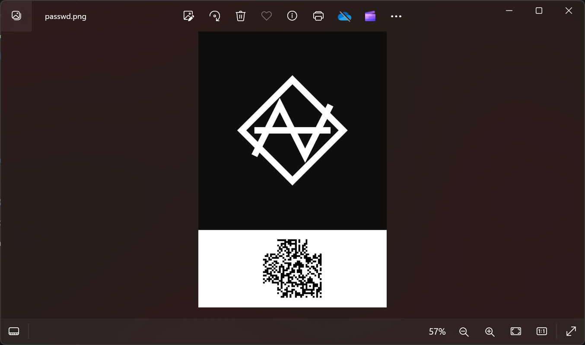

所以我们要把定位块补上，这里我们可以用 PS 也可以使用 PPT 补定位块

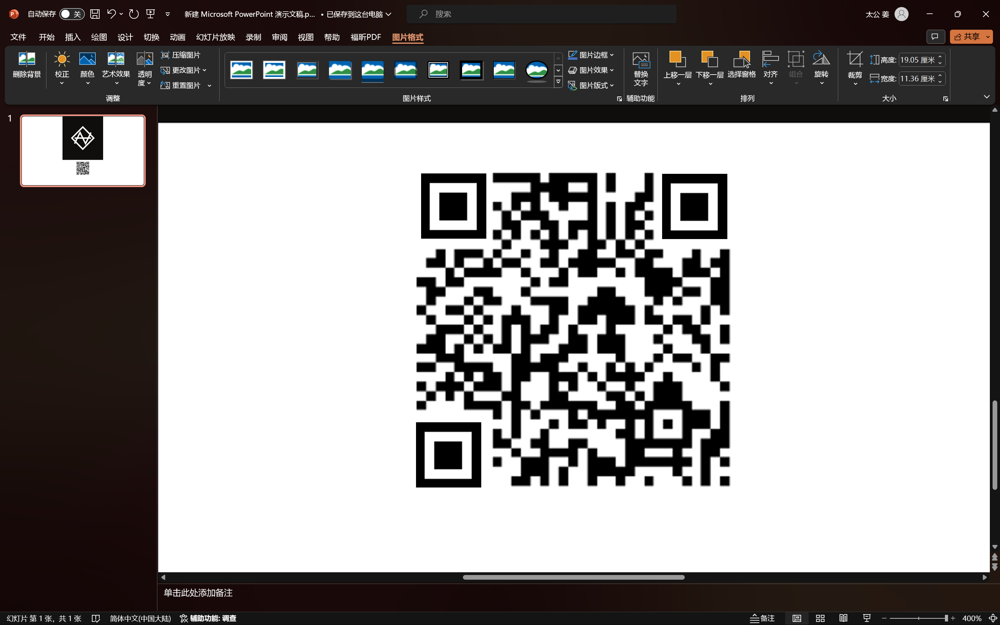

补完定位块后，直接扫码即可得到一串数字：6470e394cbf6dab6a91682cc8585059b

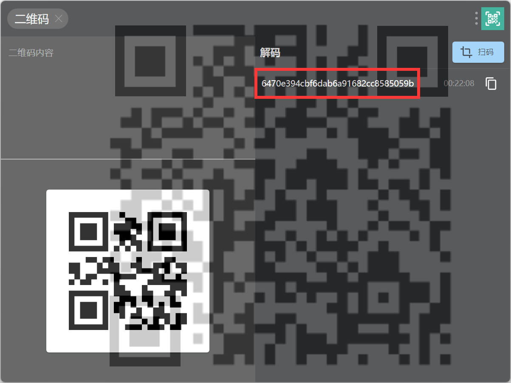

得到的这串数字就是压缩包密码，然后我们解压压缩包，可以得到 flag.png 和 key.txt

key.txt 中有很多不可见字符，猜测是零宽隐写

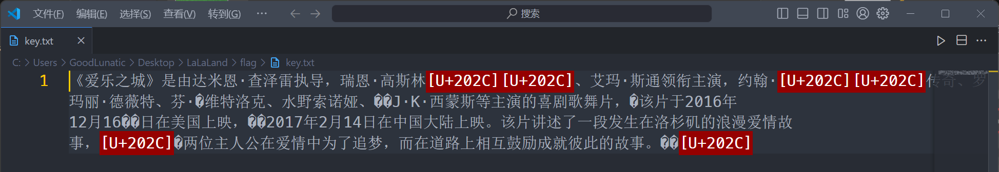

直接使用在线网站解密即可，这里可能要稍微试几个网站

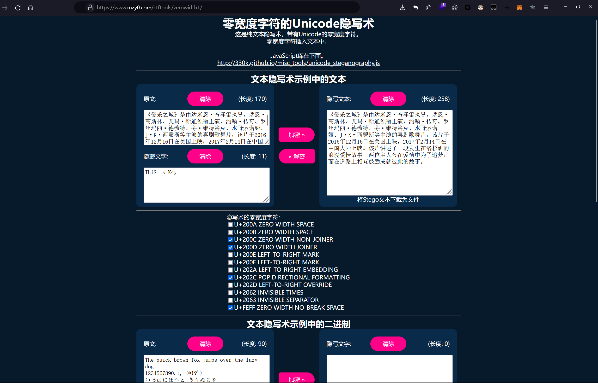

零宽隐写解密后可以得到：ThiS_1s_K4y

然后 cloacked-pixel 使用上面得到的那个 key 解密 flag.png

```bash
python2 lsb.py extract flag.png flag.txt ThiS_1s_K4y
```

解密后可以得到如下内容，一眼 brainfuck

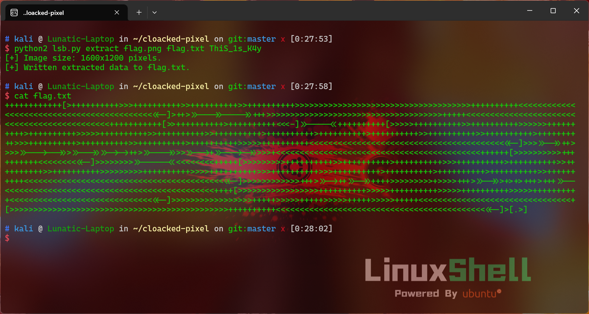

```
++++++++++++[>++++++++++>>>++++++++++>>++++++++++>>++++++++++>>>>>>>>>>>>>>>>>>>>>>>>>>>>>>>>>>>>>++++++++++<<<<<<<<<<<<<<<<<<<<<<<<<<<<<<<<<<<<<<<<<<<<<-]>++>>>--->>---->>+++>>>>>>>>>>>>>>>>>>>>>>>>>>>>>>>>>>>>>+++++<<<<<<<<<<<<<<<<<<<<<<<<<<<<<<<<<<<<<<<<<<<<<+++++++++++[>>++++++++++>++++++++++<<<-]>>----<<++++++++++[>>>>>++++++++++>>++++++++++>>>>>>++++++++++>++++++++++>>>>>++++++++++>>++++++++++>>++++++++++>++++++++++>++++++++++>++++++++++>>++++++++++>>++++++++++>++++++++++>>>++++++++++>++++++++++>>++++++++++>++++++++++>>>>>++++++++++<<<<<<<<<<<<<<<<<<<<<<<<<<<<<<<<<<<<<<<<<<<-]>>>>>->>++>>>>>>--->-->>>>>-->>>>->->++>>>--->>>>>>-->+>>--->->>>>>+<<<<<<<<<<<<<<<<<<<<<<<<<<<<<<<<<<<<<<<<<<<++++++[>>>>>>>>>>++++++++++<<<<<<<<<<-]>>>>>>>>>>-----<<<<<<<<<<+++++[>>>>>>>>>++++++++++>>++++++++++>++++++++++>>>++++++++++>++++++++++>>++++++++++>>++++++++++>>>>>>>>>++++++++++>>>>++++++++++>>>++++++++++>>>++++++++++>++++++++++>++++++++++>++++++++++>>++++++++++<<<<<<<<<<<<<<<<<<<<<<<<<<<<<<<<<<<<<<<<<<<<-]>>>>>>>>>>>>+++>>>->++>>->>++++>>>>>>>>>+>>>>+++>>>->>>+>+>+++>+++>>--<<<<<<<<<<<<<<<<<<<<<<<<<<<<<<<<<<<<<<<<<<<<++++[>>>>>>>>>>>>>>>>>++++++++++>>>>>++++++++++>>>>>++++++++++>>>>>++++++++++<<<<<<<<<<<<<<<<<<<<<<<<<<<<<<<<-]>>>>>>>>>>>>>>>>>+++++>>>>>+++++>>>>>+++++>>>>>+++++<<<<<<<<<<<<<<<<<<<<<<<<<<<<<<<<+[>>>>>>>>>>>>>>>>>>>>>>>>>>>>>>>>>>>>>>>>>>>>>>++++++++++<<<<<<<<<<<<<<<<<<<<<<<<<<<<<<<<<<<<<<<<<<<<<<-]>[.>]
```

 最后使用 在线网站 或者 随波逐流 解密 brainfuck 即可得到 flag：zjnuctf{2725ab14-1b6d-ccfd-a3dd-5be1ac3355e0}

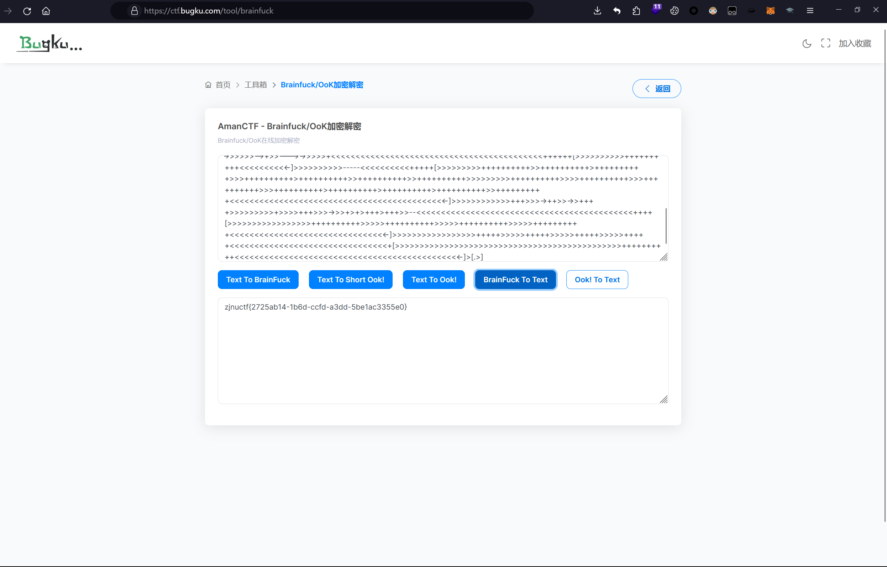

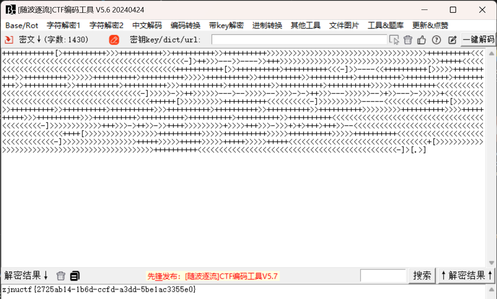